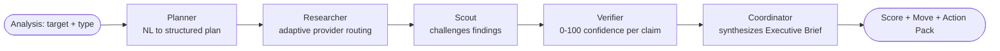
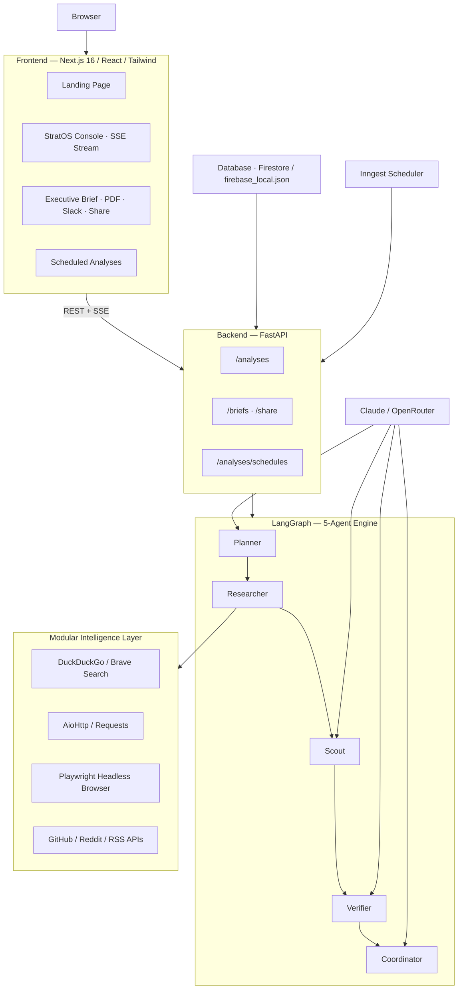

<div align="center">

# StratOS AI

### Autonomous competitive intelligence for B2B revenue and strategy teams

**StratOS AI turns live public-web signals into verified, recurring competitive
intelligence and decisive executive action briefs.**


</div>

---

## One-line value proposition

StratOS AI is an autonomous competitive-intelligence platform that turns live
public-web signals into verified, recurring intelligence and a decisive executive
action brief — for B2B revenue and strategy teams who currently do this by hand.

---

## The problem

Most B2B companies do not have a competitive-intelligence team. Revenue,
product-marketing, and strategy leaders track competitors and strategic accounts by
hand — a browser tab, a Google alert, a spreadsheet updated when someone remembers. By
the time a competitor's pricing change, funding event, leadership move, or product
launch is noticed, the window to respond has often already closed.

The signal exists in real time on the public web. The bottleneck is **reliable access
to that web at scale** — much of the highest-value content sits behind bot protection,
JavaScript rendering, or complex page layouts — combined with the analyst time to
research it, challenge it, verify it, and turn it into a decision.

Existing tools each miss one leg of that: one-shot answer engines don't monitor;
dashboards are structured but stale; hiring an analyst is slow and expensive. None of
them deliver a *recurring, verified, decisive* recommendation.

---

## The product

Point StratOS AI at a target — a competitor or a strategic account — and it runs a
five-agent pipeline that plans the research, executes it across the live web via modular intelligence tools, adversarially challenges the findings, scores its own confidence, and commits to an **Executive Strategic Brief**:

- **Market Move Score** (0–100) — how urgent/material the signal is
- **Recommended Move** — ATTACK / DEFEND / ESCALATE / WAIT / MONITOR (a decision, not a summary)
- **Confidence** (0–100) — the *quality* of the evidence found, not how many tools fired
- **Action Pack** — sequenced actions for Immediate / This Week / Watch
- **Coordinator Rationale** — why this move was chosen over the alternatives

Briefs can be copied as Markdown, exported to PDF, shared via a public link, delivered
to Slack, and re-run on a recurring schedule so the intelligence stays current.

---

## Who it is for

The **initial market wedge is Competitive Intelligence** for B2B teams that research
competitors and strategic accounts manually today:

- Competitive Intelligence
- Revenue Operations
- Product Marketing
- Strategy teams
- B2B founders and commercial leaders

Typical fit: **B2B companies of roughly 50–1,000 employees.** StratOS is a platform,
not three products — Supplier Watch and Threat Surface (below) are **expansion modules**
that reuse the same engine, not separate businesses.

---

## Core competitive-intelligence workflow

1. **Choose a target** — a competitor domain or a strategic account.
2. **Pick an analysis type** — Account Pulse is the flagship CI workflow.
3. **Deploy** — the five-agent pipeline runs and streams progress live via Server-Sent Events (SSE).
4. **Read the brief** — score, move, confidence, action pack, rationale, provenance.
5. **Distribute** — Markdown / PDF / share link / Slack.
6. **Recur** — schedule the analysis so the brief refreshes and diffs against the last run.

---

## How the agent system works



| Agent | Role |
|-------|------|
| **Planner** | Parses the natural-language target + analysis type into a structured research plan, assigning data-access capabilities to each step. |
| **Researcher** | Executes the plan across search, HTTP fetchers, headless browsers, and official APIs, applying per-capability timeouts and retries. |
| **Scout** | Adversarially challenges each finding — identifying missing, unverified, or inconsistent claims. |
| **Verifier** | Resolves challenges and scores confidence by *evidence quality*, not step count. Empty/timed-out steps limit scope; they don't by themselves lower confidence. |
| **Coordinator** | Synthesizes the Executive Strategic Brief and commits to a move with an explicit rationale. |

The LLM layer uses Anthropic Claude Sonnet via OpenRouter, orchestrated
with LangGraph. See [docs/architecture/ARCHITECTURE.md](docs/architecture/ARCHITECTURE.md).

---

## Modular Intelligence Layer

StratOS AI features a provider-agnostic **Intelligence Layer** (`intelligence/tools/manager.py`) that separates AI agent orchestration from specific web, browser, or search APIs. Every external capability is a pluggable, interchangeable module:

| Capability | Supported Swappable Providers |
|------------|--------------------------------|
| **Search Providers** | DuckDuckGo Search (default keyless search), Brave Search (optional API key fallback) |
| **Fetch Providers** | Async AioHttp (default high-concurrency fetch), Requests HTML |
| **Browser Providers** | Playwright (local headless Chromium for JS rendering & bot-protected pages) |
| **Extraction Providers** | BeautifulSoup (HTML structure cleaner), Trafilatura (main text extractor), Markdownify |
| **Official APIs** | Direct endpoint connectors for GitHub API, Reddit API, RSS feeds |
| **Storage & Cache** | Local file DB (`firebase_local.json`) or Cloud Firestore (24h TTL for fetched profiles) |

---

## Intelligent Routing & Failover

The design principle is: **route each research task to the minimum reliable provider** for that task, based on source type, rendering requirements, latency, accessibility, and expected information value.

1. **Official APIs** are prioritized first if the target URL matches (e.g., GitHub, Reddit, or RSS feeds).
2. **Keyless & Fallback Search**: DuckDuckGo Search executes web & news queries with zero credentials required; automatically falls back to Brave Search if configured.
3. **Fetch & Browser**: Fast async HTTP requests fetch static pages; dynamic or anti-bot targets (e.g., LinkedIn, Crunchbase) automatically execute local Playwright Chromium headless browsing.
4. **Caching**: Cached responses in local database or Firestore are checked before any external request, keeping responses to minimize external latency.

---

## Evidence and verification

Every brief distinguishes:

- **Evidence** — a specific, attributable claim (in a live run: acquisition method, source URL, fetch time).
- **Inference** — a conclusion the pipeline drew by combining evidence (reasoning, not fact).
- **Recommendation** — the Coordinator's decisive move and why it beat the alternatives.
- **Confidence** — a 0–100 quality score for the evidence found.

The Scout → Verifier stages exist specifically to reduce false confidence: findings
are challenged before they are scored, and confidence reflects corroboration quality.

---

## Recurring monitoring

Analyses can run on a schedule (via Inngest) so intelligence stays current instead of
being a one-off lookup. Each run **diffs against the prior run** on the same target —
score delta, confidence delta, move change, new vs. resolved findings — so a reader sees
*what changed*, which is the actual job of competitive intelligence.

---

## Live mode vs. deterministic demo mode

StratOS runs in two clearly separated modes:

| | **Live run** | **Deterministic demo fixture** |
|---|---|---|
| Trigger | Deploy an analysis with OpenRouter API key configured | Read `docs/sample-briefs/` |
| Data | Live public web via keyless DDG, Playwright, & APIs | Hand-curated, captured on a stated date |
| Timestamps | Real per-call latency + wall time | Illustrative only |
| Freshness | Current as of the run | As stale as the fixture's `Facts as-of` date |
| Labeling | UI streams real-time agent events during the run | Every fixture is stamped `DETERMINISTIC DEMO FIXTURE` |

The sample briefs in this repo are **deterministic demo fixtures** so a reviewer can see
the output format without credentials. They are not, and do not claim to be, live runs.
See [docs/sample-briefs/README.md](docs/sample-briefs/README.md).

There is also a **cached path**: structured scraper results are cached in Cloud Firestore or local storage (`firebase_local.json`, 24h TTL), so a repeat analysis on the same target returns the cached structured profile quickly instead of re-triggering a snapshot.

---

## Current product status

| Capability | Status |
|---|---|
| 5-agent LangGraph pipeline (Planner → Researcher → Scout → Verifier → Coordinator) | Implemented |
| Account Pulse analysis (CI wedge) | Implemented |
| Supplier Watch / Threat Surface (expansion modules) | Implemented |
| Keyless DuckDuckGo Search, Playwright Browser, GitHub/Reddit/RSS APIs | Implemented — keyless search works out-of-the-box |
| Real-time SSE agent event stream | Implemented |
| Executive Strategic Brief (score, move, confidence, action pack, rationale) | Implemented |
| Copy Markdown / PDF export / public share link / Slack delivery | Implemented |
| Recurring scheduled analyses + analysis diffing | Implemented |
| Zero-config local database fallback (`firebase_local.json`) | Implemented |
| Deterministic demo fixtures (labeled) | Provided |
| Paying customers / active pilots / revenue | **None claimed** — see Startup Status |

Statuses describe what is in the codebase. Live execution requires an OpenRouter API key (see [Environment variables](#environment-variables)).

---

## Initial market

Competitive Intelligence for B2B revenue and strategy teams (≈50–1,000 employees) who
research competitors and strategic accounts manually today. This is the **wedge** — one
buyer, one recurring job-to-be-done — not a horizontal "intelligence for everything"
pitch.

## Expansion modules

The same engine supports adjacent verticals, kept deliberately secondary to the CI wedge:

- **Supplier Watch** — supplier financial-health and supply-chain risk monitoring.
- **Threat Surface** — security/compliance exposure monitoring.

These demonstrate that the platform is extensible; they are not positioned as three
separate startups.

---

## Architecture



Full architecture details: [docs/architecture/ARCHITECTURE.md](docs/architecture/ARCHITECTURE.md).

---

## Local setup

**Prerequisites:** Node 18+, Python 3.11+, uv, an OpenRouter API key.

```powershell
git clone https://github.com/pranav-bhagath19/StratOS-AI.git
cd StratOS-AI

# 1. Backend Setup
cd backend
uv sync
# Copy .env.example if .env does not exist yet:
Copy-Item ../.env.example .env
# Set your OPENROUTER_API_KEY in .env
$env:PYTHONPATH=".."
uv run uvicorn main:app --reload --port 8000

# 2. Frontend Setup (in a new terminal)
cd frontend
npm install
# Set NEXT_PUBLIC_API_URL=http://localhost:8000 in frontend/.env.local if needed
npm run dev

# 3. Inngest Scheduler (optional, in a new terminal)
npx inngest-cli@latest dev -u http://localhost:8000/api/inngest
```

Open `http://localhost:3000` → **Open StratOS** → deploy an analysis.

### Environment variables

| Variable | Description & Where to get it |
|---|---|
| `OPENROUTER_API_KEY` | **Required.** OpenRouter dashboard API Keys (powers LLM operations) |
| `SEARCH_PROVIDER` | `duckduckgo` (default keyless search) or `brave` |
| `BRAVE_API_KEY` | Optional. Brave Search API dashboard (fallback search provider) |
| `FIREBASE_PROJECT_ID` / `FIREBASE_PRIVATE_KEY` / `FIREBASE_CLIENT_EMAIL` | Optional. Firebase Console → Service Accounts. Omitting these automatically falls back to local database `firebase_local.json`. |
| `NEXT_PUBLIC_API_URL` | Frontend env (default `http://localhost:8000`) |

`backend/.env` is git-ignored and must never be committed. `.env.example` ships with
empty placeholder values only.

---

## Running tests

```powershell
# Run backend test suite
cd backend
uv run pytest

# Run specific backend test modules
uv run pytest ../tests/unit/test_providers.py -v
uv run pytest ../tests/integration/test_brief_provenance.py -v
uv run pytest ../tests/integration/test_db.py -v
uv run pytest ../tests/integration/test_health.py -v

# Frontend Checks
cd ../frontend
npm run lint
npx tsc --noEmit
npm run build
```

---

## Deployment

- **Frontend:** Vercel (Next.js 16). Set `NEXT_PUBLIC_API_URL` to the production backend URL.
- **Backend:** Any container or cloud service (e.g. Render, Railway, Cloud Run). Set environment variables above.
- **Database:** Firebase Cloud Firestore (automatically falls back to zero-config local file database `firebase_local.json`).
- **Scheduler:** Inngest (`/api/inngest`).

A deployed instance is at [stratos-ai.vercel.app](https://stratos-ai.vercel.app). Live
analysis behavior on any deployment depends on the backend having a valid OpenRouter key.

---

## Startup Status

StratOS AI is a **bootstrapped, founder-led, pre-seed** product with a **working MVP**
and a production-oriented architecture. We are preparing structured **design-partner
pilots** with B2B teams that rely on manual competitor and strategic-account research.

To be explicit about what is **not** claimed:

- No paid revenue.
- No active paying customers or logos.
- No active pilots yet (we are preparing outreach).
- No usage, performance, accuracy, cost-saving, or time-saving metrics are asserted as
  results — any such numbers in our docs are **target metrics** or **evaluation
  frameworks**, clearly labeled.

---

## Design partner program

We are opening a small **design-partner program** for CI, RevOps, Product Marketing,
Strategy, and B2B-founder teams. Partners help us validate recurring usage and decision
usefulness on real targets. What it involves, what partners receive, what is *not* yet
guaranteed, and how data is handled: [docs/development/DESIGN_PARTNER_PROGRAM.md](docs/development/DESIGN_PARTNER_PROGRAM.md).

To express interest, open a GitHub issue on this repository (the verifiable contact
channel) — see the program doc for details.

---

## Roadmap

Directional and intentionally un-inflated:

- **Near term** — cost-minimizing adaptive router; per-evidence acquisition-method + timestamp persisted on every finding; a reproducible brief-regression benchmark.
- **Next** — email delivery; custom analysis templates; per-client configuration; CRM payload sync (HubSpot / Salesforce) as an opt-in export.
- **Later** — self-hosted option; SSO; tenant-isolated Firestore security rules.

Sequencing depends on design-partner feedback, not a fixed date.

---

## Limitations

- Live behavior requires a valid OpenRouter API key; without it, LLM agents cannot run.
- Sample briefs are deterministic demo fixtures and may be stale.
- LLM output can be wrong; the Scout/Verifier stages reduce but do not eliminate that
  risk. Briefs are decision support, not ground truth.

---

## Security and responsible data use

- StratOS accesses **public** web data and does not attempt to defeat authentication or
  access private/logged-in content.
- Secrets live only in git-ignored `.env` files; `.env.example` contains no real values.
- Firebase Admin private credentials are used server-side only.
- Briefs are decision support and should be independently validated before high-stakes
  action.

---

## Project origin

StratOS AI originated as a functional prototype for autonomous competitive intelligence and is now being developed into an independent commercial product. The architecture validates a multi-agent pipeline over a modular, provider-agnostic web intelligence layer. The next stage is validating customer demand, recurring usage, and commercial value through design-partner pilots.

---

## License and contact

MIT — see [LICENSE](LICENSE).

Built by [Pranav-Bhagath](https://github.com/pranav-bhagath19) — based in Hyderabad, India. Contact via [GitHub issues](https://github.com/pranav-bhagath19/StratOS-AI/issues).

