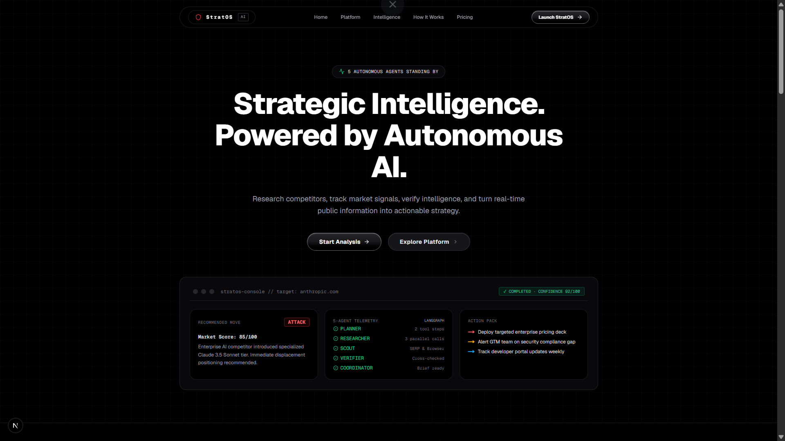
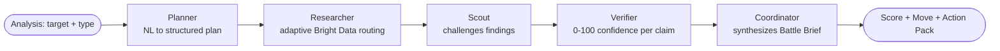
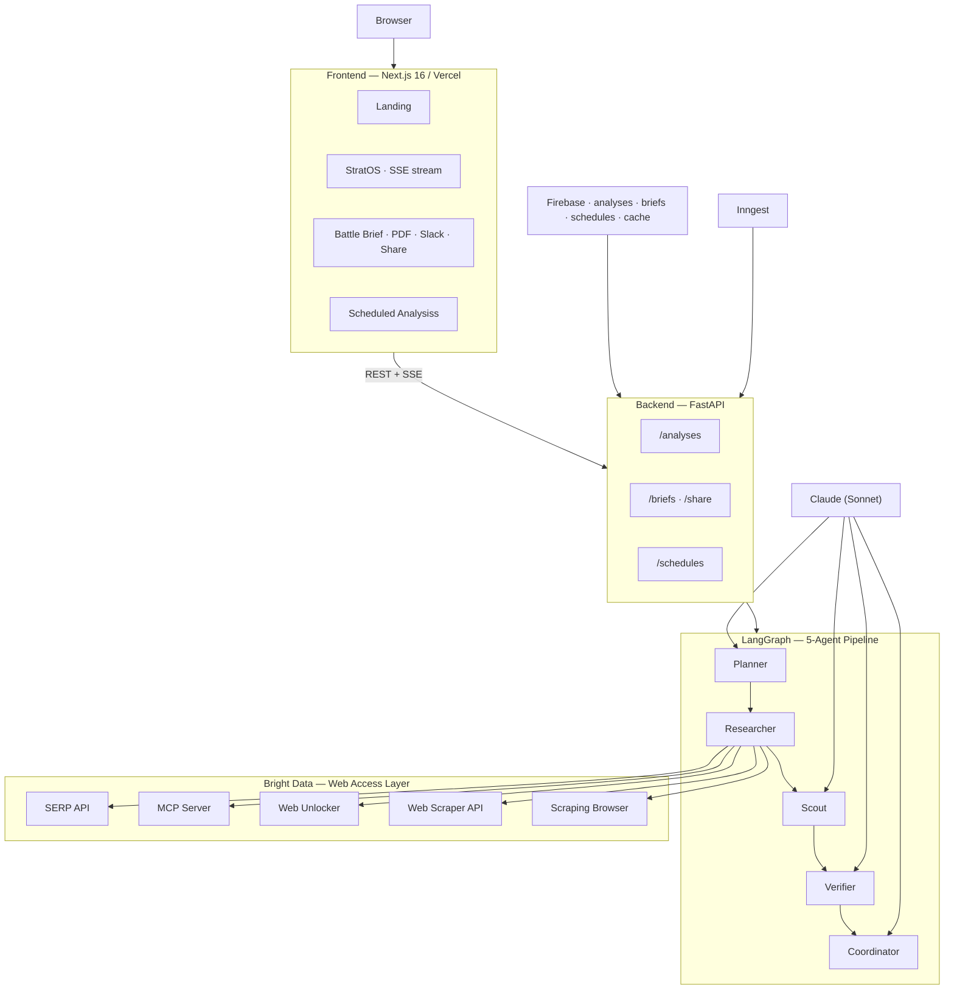

<div align="center">

# StratOS AI

### Autonomous competitive intelligence for B2B revenue and strategy teams

**StratOS AI turns live public-web signals into verified, recurring competitive
intelligence and decisive executive action briefs.**

[Live Demo](https://stratos-ai.vercel.app) · [Sample Briefs](docs/sample-briefs/) · [Design Partners](docs/DESIGN_PARTNER_PROGRAM.md)




</div>

---

## One-line value proposition

StratOS AI is an autonomous competitive-intelligence platform that turns live
public-web signals into verified, recurring intelligence and a decisive executive
action brief — for B2B revenue and strategy teams who currently do this by hand.

---

## The problem

Most B2B companies do not have a competitive-intelligence team. Revenue,
product-marketing, and strategy leaders track competitors and strategic accounts by
hand — a browser tab, a Google alert, a spreadsheet updated when someone remembers. By
the time a competitor's pricing change, funding event, leadership move, or product
launch is noticed, the window to respond has often already closed.

The signal exists in real time on the public web. The bottleneck is **reliable access
to that web at scale** — much of the highest-value content sits behind bot protection,
JavaScript rendering, or geographic restrictions — combined with the analyst time to
research it, challenge it, verify it, and turn it into a decision.

Existing tools each miss one leg of that: one-shot answer engines don't monitor;
dashboards are structured but stale; hiring an analyst is slow and expensive. None of
them deliver a *recurring, verified, decisive* recommendation.

---

## The product

Point StratOS AI at a target — a competitor or a strategic account — and it runs a
five-agent pipeline that plans the research, executes it across the live web via Bright
Data, adversarially challenges the findings, scores its own confidence, and commits to
an **Executive Strategic Brief**:

- **Market Move Score** (0–100) — how urgent/material the signal is
- **Recommended Move** — ATTACK / DEFEND / ESCALATE / WAIT / MONITOR (a decision, not a summary)
- **Confidence** (0–100) — the *quality* of the evidence found, not how many tools fired
- **Action Pack** — sequenced actions for Immediate / This Week / Watch
- **Coordinator Rationale** — why this move was chosen over the alternatives

Briefs can be copied as Markdown, exported to PDF, shared via a public link, delivered
to Slack, and re-run on a recurring schedule so the intelligence stays current.

---

## Who it is for

The **initial market wedge is Competitive Intelligence** for B2B teams that research
competitors and strategic accounts manually today:

- Competitive Intelligence
- Revenue Operations
- Product Marketing
- Strategy teams
- B2B founders and commercial leaders

Typical fit: **B2B companies of roughly 50–1,000 employees.** StratOS is a platform,
not three products — Supplier Watch and Threat Surface (below) are **expansion modules**
that reuse the same engine, not separate businesses.

---

## Core competitive-intelligence workflow

1. **Choose a target** — a competitor domain or a strategic account.
2. **Pick a analysis type** — Account Pulse is the flagship CI workflow.
3. **Deploy** — the five-agent pipeline runs and streams progress live.
4. **Read the brief** — score, move, confidence, action pack, rationale, provenance.
5. **Distribute** — Markdown / PDF / share link / Slack.
6. **Recur** — schedule the analysis so the brief refreshes and diffs against the last run.

---

## How the agent system works



| Agent | Role |
|-------|------|
| **Planner** | Parses the natural-language target + analysis type into a structured research plan, assigning a data-access capability to each step. |
| **Researcher** | Executes the plan across the live web via Bright Data, applying per-capability timeouts, a retry policy, and content-quality checks. |
| **Scout** | Adversarially challenges each finding — what is missing, unverified, or inconsistent. |
| **Verifier** | Resolves challenges and scores confidence by *evidence quality*, not step count. Empty/timed-out steps limit scope; they don't by themselves lower confidence. |
| **Coordinator** | Synthesizes the Battle Brief and commits to a move with an explicit rationale. |

The LLM layer uses Anthropic Claude (Sonnet) via `langchain-anthropic`, orchestrated
with LangGraph. See [ARCHITECTURE.md](ARCHITECTURE.md).

---

## Modular Intelligence Layer

StratOS AI features a provider-agnostic **Intelligence Layer** that separates the AI agent orchestration from specific data-gathering APIs, browsers, or search engines. Every external capability is a pluggable, interchangeable module:

| Capability | Supported Swappable Providers |
|------------|--------------------------------|
| **Search Providers** | Brave Search (default), DuckDuckGo (fallback), Tavily, Exa, Bright Data SERP |
| **Fetch Providers** | HTTPX Requests (default), Firecrawl, Bright Data Web Unlocker |
| **Browser Providers** | Playwright (default local headless Chromium), Bright Data Scraping Browser |
| **Extraction Providers** | HTML Boilerplate cleaner, markdownify, JSON structured extraction |
| **Official APIs** | Direct endpoint connectors for GitHub, Reddit, RSS, news, company metadata |

---

## Intelligent Routing & Failover

The design principle is: **route each research task to the minimum reliable provider** for that task, based on source type, rendering requirements, latency, accessibility, and expected information value.

1. **Official APIs** are prioritized first if the target URL matches (e.g. GitHub or Reddit).
2. **Search Providers** execute queries with automatic failover (Brave Search ➔ DuckDuckGo fallback).
3. **Fetch & Browser** actions use a dynamic decision flow: static pages use fast Requests, pages needing JS rendering execute local Playwright Chromium headless, and complex scrapers execute Firecrawl or remote browsers.
4. **Caching** is checked before any external request, keeping responses for 24 hours to minimize external latency and credit use.


---

## Evidence and verification

Every brief distinguishes:

- **Evidence** — a specific, attributable claim (in a live run: acquisition method, source URL, fetch time).
- **Inference** — a conclusion the pipeline drew by combining evidence (reasoning, not fact).
- **Recommendation** — the Coordinator's decisive move and why it beat the alternatives.
- **Confidence** — a 0–100 quality score for the evidence found.

The Scout → Verifier stages exist specifically to reduce false confidence: findings
are challenged before they are scored, and confidence reflects corroboration quality.

---

## Recurring monitoring

Analysiss can run on a schedule (via Inngest) so intelligence stays current instead of
being a one-off lookup. Each run **diffs against the prior run** on the same target —
score delta, confidence delta, move change, new vs. resolved findings — so a reader sees
*what changed*, which is the actual job of competitive intelligence.

---

## Live mode vs. deterministic demo mode

StratOS runs in two clearly separated modes:

| | **Live run** | **Deterministic demo fixture** |
|---|---|---|
| Trigger | Deploy a analysis with credentials configured | Read `docs/sample-briefs/` |
| Data | Live public web via Bright Data at execution time | Hand-curated, captured on a stated date |
| Timestamps | Real per-call latency + wall time | Illustrative only |
| Freshness | Current as of the run | As stale as the fixture's `Facts as-of` date |
| Labeling | UI shows live coverage counters during the run | Every fixture is stamped `DETERMINISTIC DEMO FIXTURE` |

The sample briefs in this repo are **deterministic demo fixtures** so a reviewer can see
the output format without credentials. They are not, and do not claim to be, live runs.
See [docs/sample-briefs/README.md](docs/sample-briefs/README.md).

There is also a **cached path**: structured scraper results are cached in Cloud Firestore
(24h TTL), so a repeat analysis on the same target returns the cached structured profile
quickly instead of re-triggering a snapshot. A cached execution is not a full cold run
and is labeled as such in the coverage panel (`0ms (cache)`).

---

## Current product status

| Capability | Status |
|---|---|
| 5-agent LangGraph pipeline (Planner → Researcher → Scout → Verifier → Coordinator) | Implemented |
| Account Pulse analysis (CI wedge) | Implemented |
| Supplier Watch / Threat Surface (expansion modules) | Implemented |
| Keyless DuckDuckGo Search, requests/aiohttp, Scraping Browser, MCP Server | Implemented — require credentials to run live |
| Real-time SSE agent event stream + coverage panel | Implemented |
| Executive Strategic Brief (score, move, confidence, action pack, rationale) | Implemented |
| Copy Markdown / PDF export / public share link / Slack delivery | Implemented |
| Recurring scheduled analyses + analysis diff | Implemented |
| Scraper API response cache (Cloud Firestore, 24h TTL) | Implemented |
| Deterministic demo fixtures (labeled) | Provided |
| Cost-minimizing adaptive router | Designed — see roadmap |
| Paying customers / active pilots / revenue | **None claimed** — see Startup Status |

Statuses describe what is in the codebase. Live behavior depends on valid OpenRouter credentials and a reachable Firebase project (see
[Environment variables](#environment-variables)).

---

## Initial market

Competitive Intelligence for B2B revenue and strategy teams (≈50–1,000 employees) who
research competitors and strategic accounts manually today. This is the **wedge** — one
buyer, one recurring job-to-be-done — not a horizontal "intelligence for everything"
pitch.

## Expansion modules

The same engine supports adjacent verticals, kept deliberately secondary to the CI wedge:

- **Supplier Watch** — supplier financial-health and supply-chain risk monitoring.
- **Threat Surface** — security/compliance exposure monitoring.

These demonstrate that the platform is extensible; they are not positioned as three
separate startups.

---

## Architecture



Full layer decisions: [ARCHITECTURE.md](ARCHITECTURE.md).

---

## Local setup

**Prerequisites:** Node 18+, pnpm, Python 3.11+, uv, a Firebase project, an OpenRouter API key.

```powershell
git clone https://github.com/jpablortiz96/stratos-ai.git
cd stratos-ai

# Backend
cd api
uv sync
Copy-Item .env.example .env
# Fill in the variables below:
# Firebase credentials can be omitted to fall back to local JSON database (`firebase_local.json`).
$env:PYTHONPATH="."; uv run uvicorn app.api.main:app --reload --port 8000

# Frontend (new terminal)
cd web
pnpm install
Copy-Item .env.local.example .env.local   # set NEXT_PUBLIC_API_URL=http://localhost:8000
pnpm dev

# Inngest scheduler (optional, new terminal)
npx inngest-cli@latest dev -u http://localhost:8000/api/inngest
```

Open `http://localhost:3000` → **Open StratOS** → deploy a analysis.

### Environment variables

| Variable | Where to get it |
|---|---|
| `ANTHROPIC_API_KEY` | console.anthropic.com |
| `OPENROUTER_API_KEY` | OpenRouter dashboard API Keys |
| `BRAVE_API_KEY` | Brave Search API dashboard |
| `TAVILY_API_KEY` | Tavily Search dashboard (optional) |
| `EXA_API_KEY` | Exa AI dashboard (optional) |
| `FIRECRAWL_API_KEY` | Firecrawl API dashboard (optional) |
| `FIREBASE_PROJECT_ID` / `FIREBASE_PRIVATE_KEY` / `FIREBASE_CLIENT_EMAIL` | Firebase console → Service Accounts |

`api/.env` is git-ignored and must never be committed. `api/.env.example` ships with
empty values only.

---

## Running tests

```powershell
# Run all unit and integration tests
uv run pytest

# Run specific test modules
uv run pytest tests/test_health.py -v
uv run pytest tests/test_brief_provenance.py -v
uv run pytest tests/test_db.py -v
uv run pytest tests/test_providers.py -v

# Frontend Checks
npm run lint
npx tsc --noEmit
npm run build
```

---

## Deployment

- **Frontend:** Vercel (Next.js). Set `NEXT_PUBLIC_API_URL` to the backend URL.
- **Backend:** any container/host (Procfile + `requirements.txt` provided). Set the
  environment variables above; CORS allows Vercel origins and localhost.
- **Database:** Firebase Cloud Firestore (automatically falls back to local file JSON database).
- **Scheduler:** Inngest.

A deployed instance is at [stratos-ai.vercel.app](https://stratos-ai.vercel.app). Live
analysis behavior on any deployment depends on the backend having valid credentials; a
reviewer should confirm that before treating a run as a live capability.

---

## Startup Status

StratOS AI is a **bootstrapped, founder-led, pre-seed** product with a **working MVP**
and a production-oriented architecture. We are preparing structured **design-partner
pilots** with B2B teams that rely on manual competitor and strategic-account research.

To be explicit about what is **not** claimed:

- No paid revenue.
- No active paying customers or logos.
- No active pilots yet (we are preparing outreach).
- No usage, performance, accuracy, cost-saving, or time-saving metrics are asserted as
  results — any such numbers in our docs are **target metrics** or **evaluation
  frameworks**, clearly labeled.

---

## Design partner program

We are opening a small **design-partner program** for CI, RevOps, Product Marketing,
Strategy, and B2B-founder teams. Partners help us validate recurring usage and decision
usefulness on real targets. What it involves, what partners receive, what is *not* yet
guaranteed, and how data is handled: [docs/DESIGN_PARTNER_PROGRAM.md](docs/DESIGN_PARTNER_PROGRAM.md).

To express interest, open a GitHub issue on this repository (the verifiable contact
channel) — see the program doc for details.

---

## Roadmap

Directional and intentionally un-inflated:

- **Near term** — cost-minimizing adaptive router (choose cheapest reliable capability,
  escalate only when it adds value); per-evidence acquisition-method + timestamp
  persisted on every finding; a reproducible brief-regression benchmark.
- **Next** — email delivery; custom analysis templates; per-client configuration;
  CRM payload sync (HubSpot / Salesforce) as an opt-in export.
- **Later** — self-hosted option; SSO; tenant-isolated Firestore security rules.

Sequencing depends on design-partner feedback, not a fixed date.

---

## Limitations

- Live behavior requires valid OpenRouter credentials and a configured
  Firebase project (or local JSON fallback database); without them, analyses cannot run.
- The cost-minimizing router is designed but not yet shipped; the MVP ensures broad
  coverage per analysis.
- Sample briefs are deterministic demo fixtures and may be stale.
- LLM output can be wrong; the Scout/Verifier stages reduce but do not eliminate that
  risk. Briefs are decision support, not ground truth.

---

## Security and responsible data use

- StratOS accesses **public** web data and does not attempt to defeat authentication or
  access private/logged-in content.
- Secrets live only in git-ignored `.env` files; `.env.example` contains no real values.
- Firebase Admin private credentials are used server-side only.
- Briefs are decision support and should be independently validated before high-stakes
  action.

---

## Project origin

StratOS AI originated as a functional prototype for autonomous competitive intelligence and is now being developed into an independent commercial product. The architecture validates a multi-agent pipeline over a modular, provider-agnostic web intelligence layer. The next stage is validating customer demand, recurring usage, and commercial value through design-partner pilots.

---

## License and contact

MIT — see [LICENSE](LICENSE).

Built by [Pranav-Bhagath
](https://github.com/pranav-bhagath19) — based in Hyderabad, India. Contact via
[GitHub issues](https://github.com/pranav-bhagath19/StratOS-AI/issues).
