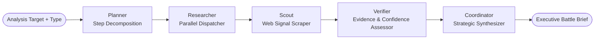

<div align="center">

# 🛡 StratOS [AI]

### Autonomous Competitive Intelligence for B2B Revenue & Strategy Teams

**StratOS AI turns live public-web signals into verified, recurring competitive intelligence and decisive executive action battle briefs.**

[Live Demo](https://stratos-ai.vercel.app) · [GitHub Repository](https://github.com/pranav-bhagath19/StratOS-AI) · [Design Partner Program](docs/DESIGN_PARTNER_PROGRAM.md)


</div>

---

## ⚡ One-Line Value Proposition

StratOS AI is an autonomous competitive-intelligence engine that orchestrates a 5-agent LLM pipeline over a provider-agnostic live web telemetry layer to deliver verified executive battle briefs and recurring market diffs.

---

## 🎯 The Problem

Most B2B companies do not have dedicated competitive intelligence teams. Revenue, product marketing, and strategy leaders track competitors manually — scattered across browser tabs, Google alerts, and spreadsheets updated whenever someone remembers. By the time a competitor's pricing change, funding round, executive hire, or product launch is noticed, the window to respond has closed.

The signal exists in real time on the public web. The bottleneck is **reliable access to that telemetry at scale** — handling bot protection, headless rendering, and API aggregation — combined with the analyst hours required to research, adversarially verify, and convert signals into decisive action.

Existing tools fall short:
- One-shot search engines don't monitor or diff changes over time.
- Dashboard tools are structured but static.
- Manual human research is slow, costly, and inconsistent.

---

## 🚀 The Product

Point StratOS AI at any competitor or strategic account domain (e.g. `anthropic.com` or `wix.com`), and it deploys a 5-agent multi-agent execution pipeline that plans research, executes live web queries, adversarially challenges findings, verifies evidence quality, and synthesizes an **Executive Battle Brief**:

- **Market Move Score** (`0–100`) — Urgency and material impact of detected web signals.
- **Recommended Executive Move** — `ATTACK` / `DEFEND` / `ESCALATE` / `WAIT` / `MONITOR` (an actionable decision, not a vague summary).
- **Confidence Score** (`0–100`) — Objective metric based on evidence corroboration quality.
- **3-Column Action Pack** — Sequenced execution steps categorized into `IMMEDIATE`, `THIS WEEK`, and `WATCH`.
- **Coordinator Rationale** — Explicit justification for why the chosen strategic move beats alternative options.

Briefs can be copied as Markdown, downloaded as PDFs, shared via public links, posted to Slack webhooks, and scheduled for automated recurring execution via Inngest.

---

## 🧠 5-Agent Multi-Agent Execution Architecture



| Agent | Specialized Role |
|---|---|
| **Planner** | Deconstructs natural-language intelligence targets into structured research execution plans. |
| **Researcher** | Dispatches parallel tool execution across search engine APIs, web scrapers, and headless browsers. |
| **Scout** | Renders web pages via Playwright headless Chromium and extracts raw live web content. |
| **Verifier** | Adversarially cross-checks findings against authoritative sources to compute a 0–100 confidence score. |
| **Coordinator** | Synthesizes verified evidence into Market Move Scores, recommended moves, and 3-column Action Packs. |

---

## 🌐 Provider-Agnostic Intelligence Layer

StratOS AI decouples agent orchestration from underlying search and extraction tools:

| Capability | Supported Swappable Providers |
|---|---|
| **Search Engine Telemetry** | Brave Search API, DuckDuckGo SERP (keyless fallback), Exa AI, Tavily |
| **Fetch & Scraper Layer** | HTTPX Requests (fast static fetch), Playwright Headless Chromium, Firecrawl API |
| **LLM Orchestration** | OpenRouter (Claude 3.5 Sonnet, GPT-4o, Llama 3) via `langchain-openai` & `langchain-anthropic` |
| **Persistence & Cache** | Google Cloud Firestore (production) & local file JSON database (`firebase_local.json` fallback) |
| **Job Scheduler** | Inngest (cron recurring runs & run-over-run diff calculation) |

---

## 🎨 Design System & Visual Language

StratOS AI features a custom **CryptGen-inspired dark monochrome visual system**:

- **Strict Palette**: Pure Black (`#000000`), Dark Zinc (`#080808` / `#0d0d0d`), and crisp White typography (`#ffffff`).
- **Branding**: Trademark `🛡 StratOS [AI]` logo featuring a thin outlined red shield mark and technical monospaced badge.
- **Button System**: Dark metallic buttons (`bg-gradient-to-b from-zinc-800 via-zinc-900 to-black`) with thin silver borders and subtle top inner highlights.
- **Navbar**: Floating capsule navigation bar with backdrop blur and responsive mobile drawer.
- **Editorial Reports**: Clean, executive-grade intelligence briefs with large score gauges, move badges, and structured action columns.

---

## 📂 Repository Structure

```
StratOS-AI/
├── frontend/                  # Next.js 16 App Router, Tailwind CSS v4, Framer Motion
│   ├── app/                   # App Router pages (landing, dashboard, pricing, share)
│   ├── components/            # Reusable UI components
│   │   ├── brand/             # StratOS AI branding & logo primitives
│   │   ├── dashboard/         # Workspace dashboard & schedule panels
│   │   ├── intelligence/      # Analysis inputs, agent pipeline status, source telemetry
│   │   ├── landing/           # Hero, bento grid, agent network, workflow
│   │   ├── layout/            # Floating capsule Navbar, Footer
│   │   ├── reports/           # Executive Battle Brief & Action Pack components
│   │   └── ui/                # Base UI primitives (buttons, cards, bento grid, spotlight)
│   └── lib/                   # API helpers & Firebase client
├── backend/                   # FastAPI backend engine
│   ├── main.py                # FastAPI entry point & REST endpoints
│   ├── api/                   # Router handlers (analyses, briefs, share, schedules, diffs)
│   └── services/              # Engine services (Inngest, SSE streaming, PDF generator)
├── intelligence/              # LangGraph multi-agent core
│   ├── agents/                # 5 specialized agent definitions
│   │   ├── planner/           # Step decomposition agent
│   │   ├── researcher/        # Parallel dispatcher agent
│   │   ├── scout/             # Web signal scraper agent
│   │   ├── verifier/          # Evidence assessment agent
│   │   └── coordinator/       # Strategic synthesis agent
│   └── tools/                 # Search, scraper, and LLM tool integrations
├── database/                  # Data access layer (Firestore & local JSON database fallback)
├── tests/                     # Unit & integration test suite
│   ├── unit/                  # Fast pytest unit tests
│   └── integration/           # E2E API and SSE pipeline tests
├── docs/                      # Architecture docs & sample briefs
└── pyproject.toml             # uv Python project configuration
```

---

## 🛠 Local Setup & Installation

### Prerequisites
- Node.js 18+ & npm
- Python 3.12+ & [`uv`](https://github.com/astral-sh/uv)
- OpenRouter API Key (for LLM orchestration)

### 1. Clone Repository
```bash
git clone https://github.com/pranav-bhagath19/StratOS-AI.git
cd StratOS-AI
```

### 2. Backend Setup (FastAPI & LangGraph)
```powershell
# Sync Python virtual environment & dependencies
uv sync

# Create backend .env file from template
Copy-Item .env.example .env

# Start FastAPI dev server on port 8000
$env:PYTHONPATH="."; uv run --project backend uvicorn backend.main:app --reload --port 8000
```

### 3. Frontend Setup (Next.js 16 & Tailwind CSS v4)
Open a new terminal:
```powershell
cd frontend
npm install

# Create frontend environment file
Copy-Item .env.example .env.local   # Set NEXT_PUBLIC_API_URL=http://localhost:8000

# Run Next.js dev server on port 3000
npm run dev
```

### 4. Scheduler Setup (Inngest — Optional)
Open a third terminal:
```powershell
npx inngest-cli@latest dev -u http://localhost:8000/api/inngest
```

Open `http://localhost:3000` in your browser to launch the StratOS AI console.

---

## 🧪 Testing & Verification

```powershell
# Run backend pytest suite
uv run pytest

# Run automated end-to-end integration test (tests full API, SSE stream & agent pipeline)
uv run python scratch/test_e2e.py

# Frontend TypeScript compilation check
cd frontend
npx tsc --noEmit
```

---

## 🛡 License & Contact

Distributed under the MIT License. See [LICENSE](LICENSE) for details.

Built by [Pranav Bhagath](https://github.com/pranav-bhagath19). Contact via [GitHub Issues](https://github.com/pranav-bhagath19/StratOS-AI/issues).
