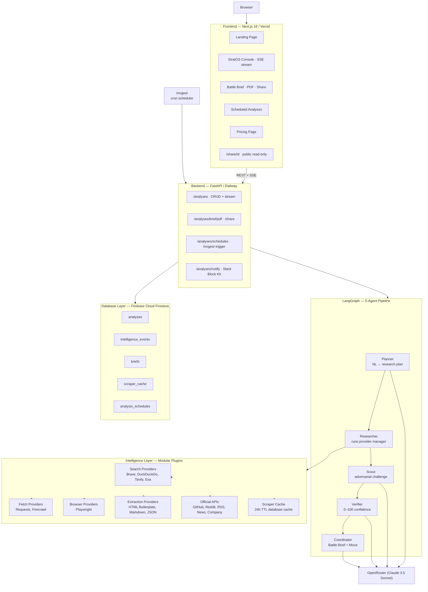

# StratOS AI — Architecture

## System Diagram



---

## Layer Decisions

### Frontend — Next.js 16 App Router

Server components handle layout, metadata, and the public share page (`/share/[id]`). The StratOS Console is a client component that opens an `EventSource` against the FastAPI SSE endpoint. Framer Motion drives agent card status transitions (idle → running → complete) with staggered preset card entry animations. Tailwind v4 CSS-first configuration keeps the build lean — no `tailwind.config.ts` required.

The frontend communicates exclusively over two channels: REST (analysis creation, brief fetch, schedule CRUD) and SSE (live agent event stream). There is no WebSocket dependency, which simplifies Railway and Vercel deployment.

### Backend — FastAPI + uvicorn

Chosen over Node.js for LangGraph's native Python API and the Bright Data Python SDK. `sse-starlette` turns any async generator into a compliant SSE stream with zero boilerplate. The SSE architecture uses an in-memory queue per analysis ID — `events.py` manages creation, subscription, and teardown. Analysis IDs map to queues; the SSE route drains the queue in real time, then cleans up when the "done" sentinel arrives.

CORS is environment-aware: `localhost:3000` in development, plus a `FRONTEND_URL` env var that injects the Vercel production origin in Railway.

### Agent Pipeline — LangGraph

LangGraph's stateful graph model maps cleanly to the StratOS flow: each agent is a node, state flows forward (Planner → Researcher → Scout → Verifier → Coordinator), and every node writes to a shared `AnalysisState` TypedDict. The Researcher node fires plan steps in parallel via `asyncio.gather`.

Key design decisions:
- **Per-product timeout budgets** (SERP 15s, MCP 20s, Unlocker 30s, Scraper 160s, Browser 35s) prevent any single slow call from blocking the gather
- **Retry-once policy** for Unlocker and Browser (60% of original timeout on second attempt)
- **Content threshold**: results under 50 characters are classified as `empty`, not `ok` — prevents LLM hallucination from short error envelopes
- **Verifier confidence calibration**: confidence measures quality of found evidence, not percentage of steps that succeeded — a brief with 2 high-quality findings and 4 empty steps scores ~78, not 33

### Latency — an honest breakdown (no universal guarantee)

There is **no single "brief in N seconds" guarantee**, because latency depends on which
capabilities a analysis needs and whether results are cached. It is more useful to think in
stages:

- **Time to first signal** — fast-access sources (SERP API) can return in seconds.
- **Time to core brief** — a analysis dominated by fast sources can complete quickly; the
  per-product timeout budgets above bound worst cases.
- **Time to deep enrichment** — Web Unlocker adds latency on protected pages; Scraping
  Browser depends on JavaScript rendering; Web Scraper API snapshots can take one to
  several minutes and run asynchronously (150s internal budget). These may continue after
  the fast core is ready.
- **Cached execution** — a repeat Scraper step on the same target returns from the Firestore
  cache (`0ms (cache)`); this is **not** a cold, full run.
- **Cold execution** — first run against a new target with no cache; the slowest path.
- **Demo execution** — deterministic demo fixtures show illustrative timings only and are
  not measured guarantees.

Any timing figure in the UI or a live brief is measured per-call at runtime; figures in
deterministic demo fixtures are illustrative.

### Intelligence Layer — Modular Plugins

The Researcher agent is powered by a provider-agnostic Intelligence Layer. Instead of being hardcoded to a single service, it accesses the web through abstract interfaces that support multiple swappable plugins:

- **Search Providers**: Keyless DuckDuckGo Search.
- **Fetch Providers**: Lightweight HTTPX Requests, and asynchronous aiohttp fetches.
- **Browser Providers**: Playwright local headless rendering. Decision flow defaults to aiohttp/Requests for static pages, and Playwright for dynamic HTML rendering.
- **Extraction Providers**: HTML boilerplate cleaning (BS4-based boilerplate/ads removal), clean Markdown rendering, and JSON object parser utilities.
- **Official APIs**: Prefer direct API retrieval (GitHub, Reddit, RSS) before launching scrapers.

All scraped content, search outputs, and raw pages are cached in the database (`scraper_cache` table) with a 24-hour TTL to minimize latency and third-party API expenditures.


### LLM — Claude Sonnet 4.6 (langchain-anthropic)

Used by Planner (plan generation), Scout (adversarial challenge), Verifier (confidence reasoning), and Coordinator (brief synthesis). Each agent has a carefully tuned system prompt:

- **Planner**: 8-word SERP query hard limit (longer queries return empty); known CEO LinkedIn URLs hardcoded to prevent hallucinated slugs; analysis-aware browser URLs per target
- **Verifier**: explicit confidence calibration examples in the system prompt prevent the model from conflating "3/6 steps succeeded" with confidence 50 — real confidence is quality of evidence, not step count
- **Coordinator**: five-tier decision framework (ESCALATE 80-95, ATTACK 65-85 with ≥3 findings, DEFEND 65-80 with ≥2 findings, WAIT 35-55, MONITOR 20-40) with explicit score boundaries

### Persistence — Firebase Cloud Firestore

Cloud Firestore stores analyses, agent events, briefs, scraper cache, and analysis schedules as document collections. All DB calls are executed via the `firebase-admin` SDK wrapped in `asyncio.to_thread` to keep the FastAPI runtime fully non-blocking. The backend automatically falls back to a local file database (`firebase_local.json`) for zero-cost offline development.

Collections:
- `analyses` — Document ID: `analysis_id`. Fields: target, analysis_type, status, created_at, updated_at.
- `intelligence_events` — Document ID: UUID. Fields: analysis_id, agent, event_type, message, payload, provider_product, created_at.
- `briefs` — Document ID: `analysis_id` (1-to-1). Fields: market_move_score, recommended_move, confidence_score, executive_summary, action_pack, provider_calls, created_at, shared_at.
- `scraper_cache` — Document ID: SHA256 hashed target URL & dataset ID. Fields: target_url, dataset_id, snapshot_id, data, created_at.
- `analysis_schedules` — Document ID: UUID. Fields: target, analysis_type, cron, label, slack_webhook_url, last_run_at, last_analysis_id, created_at.

### Scheduler — Inngest

Inngest handles recurring analysis execution. The Python SDK registers two functions:
- `analyses-run` — event-triggered, runs a full analysis graph on `stratos/analyses.run` event
- `analyses-weekly-anthropic` — cron `0 9 * * 1`, fires the Anthropic Account Pulse every Monday 9am UTC via `step.send_event`

The Inngest serve endpoint is mounted at `/api/inngest` in FastAPI via `inngest.fast_api.serve()`. The dev server command is `npx inngest-cli@latest dev -u http://localhost:8000/api/inngest`.

---

## Data Flow — One Analysis End-to-End

```
User clicks "Anthropic — Account Pulse"
  → POST /analyses/ {target: "anthropic.com", analysis_type: "account_pulse"}
  → Analysis row inserted (status: queued)
  → asyncio.create_task(_run_analysis(...)) — non-blocking
  → Return {analysis_id: "uuid"}

Frontend opens EventSource → GET /analyses/{id}/stream
  → SSE route drains intelligence_events queue in real time

LangGraph graph starts:
  Planner:    Claude builds a research plan
  Researcher: asyncio.gather fires the plan's swappable provider calls in parallel
    (each step routes to one channel; latency varies per channel
     and per target — see the latency breakdown above)
    e.g. serp_search → Search Engine (fast)
         unlocker_fetch → Lightweight Fetch (standard fetch)
         scraper_linkedin → Complex Scraper (crawled or cached)
         browser_render → Headless Browser (local rendering)
  Scout:    Claude challenges findings
  Verifier:   Claude resolves challenges, scores confidence
  Coordinator:  Claude synthesizes the brief and commits to a move

Brief inserted → analysis status: completed → SSE done event
Frontend fetches GET /analyses/{id} → renders Battle Brief
GET /analyses/{id}/diff → compares to the prior run on the same target → diff panel
```

Wall time is **not fixed** — it depends on which capabilities the analysis needs and whether
results are cached (see the latency breakdown above). Fast-source analyses complete in
seconds; deep browser/structured enrichments can take longer or run asynchronously.
